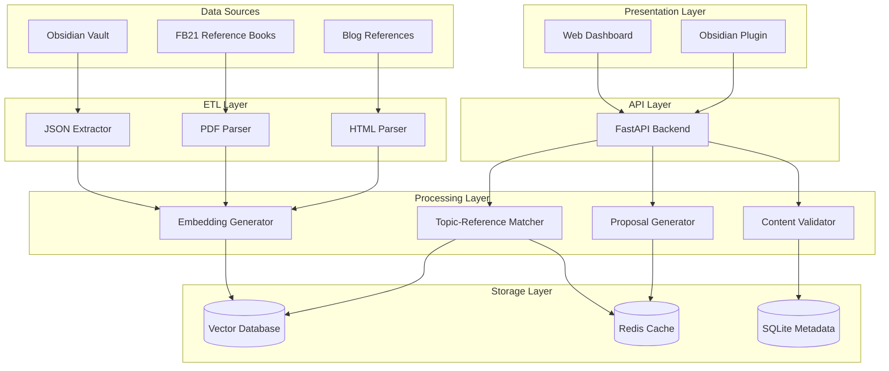
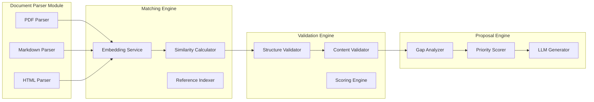
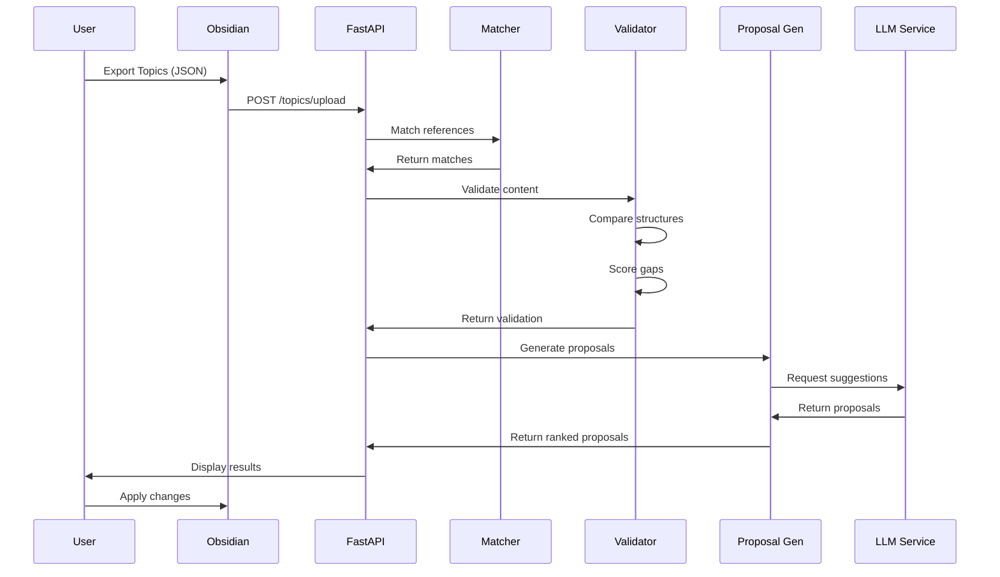
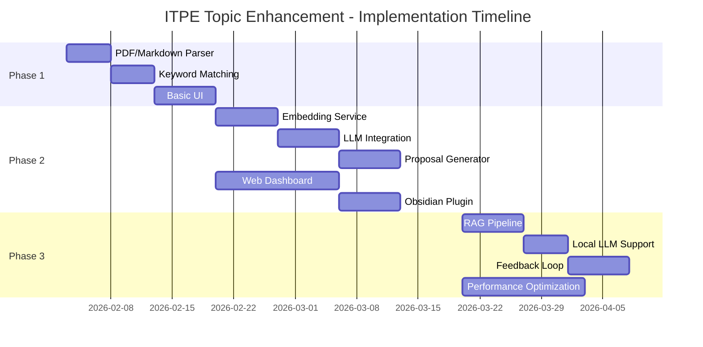

# ITPE Topic Enhancement System - System Design

**Version:** 1.0.0
**Created:** 2026-02-02
**Status:** Design Review
**Author:** ITPE Topic Enhancement Team

---

## 1. System Overview

### 1.1 Purpose

정보관리기술사 시험 준비를 위한 Obsidian 기반 토픽 관리 시스템을 자동화하여, 사용자가 작성한 토픽 노트의 정확성과 completeness를 보장하고 기술사 시험 수준으로 내용을 보강합니다.

### 1.2 Current State

**기존 구현:**
- Dataview 기반 메타데이터 추출 (리드문, 정의, 키워드, 해시태그, 암기)
- 9개 도메인 지원 (1_신기술 ~ 9_알고리즘_자료구조)
- JSON 내보내기 및 필터링 UI
- 통계 대시보드 (필드 완성도 시각화)

**한계점:**
- 수동으로 참조 문서와 대조해야 함
- 보강이 필요한 항목 식별이 어려움
- 기술사 관점에서의 검증 기준 부재

### 1.3 Goals

1. **참조 문서 자동 연동:** FB21 수험 서적과 블로그 자동 매칭
2. **지능형 검증:** 토픽 vs 참조 문서 간의 차이 자동 분석
3. **우선순위 기반 제안:** 기술사 관점에서 보강 필요 항목 추천
4. **UI/UX 개선:** 진행 상황 시각화 및 직관적인 결과 표시

### 1.4 Non-Goals

- 자동으로 토픽 내용 수정 (사용자 승인 필요)
- 완전한 새로운 토픽 생성
- 시험 예측 or 채점 시스템

---

## 2. Architecture

### 2.1 High-Level Architecture



### 2.2 Module Architecture



### 2.3 Data Flow



---

## 3. Data Model

### 3.1 Topic Model

```python
from pydantic import BaseModel, Field
from typing import List, Optional
from datetime import datetime

class TopicMetadata(BaseModel):
    """토픽 메타데이터"""
    file_path: str
    file_name: str
    folder: str
    domain: str

class TopicContent(BaseModel):
    """토픽 내용"""
    리드문: str = Field(default="")
    정의: str = Field(default="")
    키워드: List[str] = Field(default_factory=list)
    해시태그: str = Field(default="")
    암기: str = Field(default="")

class TopicCompletionStatus(BaseModel):
    """필드 완성도"""
    리드문: bool
    정의: bool
    키워드: bool
    해시태그: bool
    암기: bool

class Topic(BaseModel):
    """전체 토픽 모델"""
    metadata: TopicMetadata
    content: TopicContent
    completion: TopicCompletionStatus
    embedding: Optional[List[float]] = None
    last_validated: Optional[datetime] = None
    validation_score: Optional[float] = None
```

### 3.2 Reference Document Model

```python
class ReferenceSourceType(str, enum.Enum):
    PDF_BOOK = "pdf_book"
    BLOG = "blog"
    MARKDOWN = "markdown"

class ReferenceDocument(BaseModel):
    """참조 문서"""
    id: str
    source_type: ReferenceSourceType
    title: str
    content: str
    url: Optional[str] = None
    file_path: Optional[str] = None
    domain: str
    embedding: Optional[List[float]] = None
    trust_score: float = Field(default=1.0)  # 출처 신뢰도
    last_updated: datetime
```

### 3.3 Validation Result Model

```python
class GapType(str, enum.Enum):
    MISSING_FIELD = "missing_field"
    INCOMPLETE_DEFINITION = "incomplete_definition"
    MISSING_KEYWORDS = "missing_keywords"
    OUTDATED_CONTENT = "outdated_content"
    INACCURATE_INFO = "inaccurate_info"
    INSUFFICIENT_DEPTH = "insufficient_depth"
    MISSING_EXAMPLE = "missing_example"
    INCONSISTENT_CONTENT = "inconsistent_content"

class ContentGap(BaseModel):
    """콘텐츠 격차"""
    gap_type: GapType
    field_name: str
    current_value: str
    suggested_value: str
    confidence: float
    reference_id: str

class ValidationResult(BaseModel):
    """검증 결과"""
    topic_id: str
    overall_score: float  # 0.0 - 1.0
    gaps: List[ContentGap]
    matched_references: List[str]
    validation_timestamp: datetime
```

### 3.4 Proposal Model

```python
class ProposalPriority(str, enum.Enum):
    CRITICAL = "critical"  # 시험 필수 내용 누락
    HIGH = "high"         # 중요 개선 필요
    MEDIUM = "medium"     # 보강 권장
    LOW = "low"           # 선택적 개선

class EnhancementProposal(BaseModel):
    """보강 제안"""
    id: str
    topic_id: str
    priority: ProposalPriority
    title: str
    description: str
    current_content: str
    suggested_content: str
    reasoning: str
    reference_sources: List[str]
    estimated_effort: int  # minutes
    confidence: float
```

---

## 4. Module Design

### 4.1 Document Parser Module

**Purpose:** 참조 문서(PDF, Markdown, HTML)를 텍스트로 추출하고 구조화

**Components:**

1. **PDF Parser**
   - Library: `pdfplumber` or `PyMuPDF`
   - Features: 텍스트 추출, 표/이미지 처리, OCR 지원 (선택)
   - Output: 구조화된 텍스트 with 메타데이터

2. **Markdown Parser**
   - Library: `markdown-it-py` + custom frontmatter parser
   - Features: 제목 구조 추출, 코드블록 처리, 메타데이터 추출
   - Output: AST or 구조화된 JSON

3. **HTML Parser**
   - Library: `BeautifulSoup4`
   - Features: 본문 추출, 광고 제거, 코드 정리
   - Output: Clean text

**Interface:**
```python
class DocumentParser(Protocol):
    async def parse(self, source: str) -> ParsedDocument:
        """문서를 파싱하여 구조화된 문서 반환"""
        ...
```

### 4.2 Matching Engine

**Purpose:** 토픽과 참조 문서 간의 의미적 유사도 계산 및 매칭

**Components:**

1. **Embedding Service**
   - Model: `sentence-transformers/paraphrase-multilingual-MPNet-base-v2`
   - Language: Korean, English support
   - Dimension: 768
   - Batch size: 32

2. **Similarity Calculator**
   - Algorithm: Cosine Similarity
   - Threshold: 0.7 (configurable)
   - Top-k: 5 references per topic

3. **Reference Indexer**
   - Storage: ChromaDB (local vector DB)
   - Indexing: Batch processing
   - Updates: Incremental reindexing

**Interface:**
```python
class MatchingEngine(Protocol):
    async def find_references(
        self,
        topic: Topic,
        top_k: int = 5,
        domain_filter: Optional[str] = None
    ) -> List[MatchedReference]:
        """토픽에 관련된 참조 문서 검색"""
        ...

    async def index_references(
        self,
        references: List[ReferenceDocument]
    ) -> None:
        """참조 문서 임베딩 및 인덱싱"""
        ...
```

### 4.3 Validation Engine

**Purpose:** 토픽과 참조 문서를 비교하여 격차(gap) 식별

**Validation Rules (기술사 관점):**

1. **필수 필드 검증:**
   - 리드문: 1-2문장 핵심 요약
   - 정의: 기술사 수준 정확한 정의
   - 키워드: 최소 3개 이상
   - 해시태그: 도메인 분류용
   - 암기: 시험 대상 핵심 내용

2. **내용 정확성:**
   - 참조 문서와의 의미적 일치도
   - 기술 용어 정확성
   - 최신 트렌드 반영 여부

3. **완성도 점수:**
   ```
   score = (
       field_completeness * 0.3 +
       content_accuracy * 0.4 +
       reference_coverage * 0.3
   )
   ```

**Interface:**
```python
class ValidationEngine(Protocol):
    async def validate(
        self,
        topic: Topic,
        references: List[ReferenceDocument]
    ) -> ValidationResult:
        """토픽 검증 및 격차 분석"""
        ...

    async def score_completion(
        self,
        topic: Topic
    ) -> float:
        """토픽 완성도 점수 계산 (0.0 - 1.0)"""
        ...
```

### 4.4 Proposal Generator

**Purpose:** 검증 결과를 바탕으로 우선순위별 보강 제안 생성

**Components:**

1. **Gap Analyzer**
   - Missing fields 식별
   - Incomplete content detection
   - Outdated information flagging

2. **Priority Scorer**
   - Critical: 시험 필수 내용 누락
   - High: 기술사 기준 미달
   - Medium: 개선 권장
   - Low: 선택적 사항

3. **LLM Generator**
   - Model: OpenAI GPT-4o or local LLM
   - Prompt: 기술사 관점 프롬프트
   - Output: 구조화된 제안

**Prompt Template:**
```
당신은 정보관리기술사 시험 준비를 돕는 조교입니다.

토픽: {topic_name}
현재 내용: {current_content}
참조 문서: {reference_content}

기술사 시험 관점에서:
1. 누락된 핵심 내용
2. 부정확한 정보
3. 보강이 필요한 부분

을 분석하고 구체적인 개선 제안을 작성하세요.
```

**Interface:**
```python
class ProposalGenerator(Protocol):
    async def generate_proposals(
        self,
        validation_result: ValidationResult
    ) -> List[EnhancementProposal]:
        """보강 제안 생성"""
        ...

    async def rank_proposals(
        self,
        proposals: List[EnhancementProposal]
    ) -> List[EnhancementProposal]:
        """우선순위별 정렬"""
        ...
```

### 4.5 Web UI Module

**Purpose:** 진행 상황 모니터링 및 결과 시각화

**Pages:**

1. **Dashboard**
   - 전체 진행률
   - 도메인별 통계
   - 최근 검증 결과

2. **Topic List**
   - 필터링 (도메인, 완성도)
   - 정렬 (우선순위, 검증일)
   - 토픽 상세 보기

3. **Validation Detail**
   - Before/After 비교
   - 제안 목록
   - 적용/거절 버튼

4. **Reference Management**
   - 참조 문서 목록
   - 신뢰도 설정
   - 재인덱싱

**Tech Stack:**
- Frontend: React + TypeScript + Vite
- UI Library: shadcn/ui
- State Management: Zustand
- Charts: Recharts

### 4.6 Obsidian Integration

**Purpose:** Obsidian 플러그인으로 원활한 연동

**Features:**

1. **자동 JSON 추출:** Dataview 결과 자동 전송
2. **일방향 업데이트:** 제안 적용 시 마크다운 파일 수정
3. **상태 표시:** 토픽 헤더에 검증 상태 추가

**Plugin Interface:**
```typescript
interface TopicEnhancementSettings {
    apiEndpoint: string;
    autoSync: boolean;
    trustScoreThreshold: number;
}

class TopicEnhancementPlugin extends Plugin {
    async validateCurrentTopic(): Promise<void>;
    async applyProposal(topicId: string, proposalId: string): Promise<void>;
    showValidationStatus(): void;
}
```

---

## 5. API Specification

### 5.1 REST API Endpoints

```yaml
# Topic Management
POST   /api/v1/topics/upload           # 토픽 JSON 업로드
GET    /api/v1/topics                  # 토픽 목록 조회
GET    /api/v1/topics/{id}             # 토픽 상세 조회
PUT    /api/v1/topics/{id}             # 토픽 업데이트

# Validation
POST   /api/v1/validate                # 토픽 검증 요청
GET    /api/v1/validate/{task_id}      # 검증 상태 조회
GET    /api/v1/validate/{task_id}/result # 검증 결과 조회

# Proposals
GET    /api/v1/proposals               # 제안 목록 조회
POST   /api/v1/proposals/{id}/apply    # 제안 적용
POST   /api/v1/proposals/{id}/reject   # 제안 거절

# Reference Management
POST   /api/v1/references/index        # 참조 문서 인덱싱
GET    /api/v1/references              # 참조 문서 목록
PUT    /api/v1/references/{id}/trust   # 신뢰도 설정

# System Health
GET    /api/v1/health                  # 시스템 상태
GET    /api/v1/stats                   # 통계 정보
```

### 5.2 Request/Response Examples

**POST /api/v1/validate**
```json
// Request
{
  "topic_ids": ["topic-001", "topic-002"],
  "domain_filter": null,
  "reference_domains": ["all"]
}

// Response (202 Accepted)
{
  "task_id": "validation-task-123",
  "status": "queued",
  "estimated_time": 45
}
```

**GET /api/v1/validate/{task_id}/result**
```json
{
  "task_id": "validation-task-123",
  "status": "completed",
  "results": [
    {
      "topic_id": "topic-001",
      "overall_score": 0.65,
      "gaps": [
        {
          "gap_type": "missing_field",
          "field_name": "정의",
          "current_value": "",
          "suggested_value": "FDM은 주파수 대역을...",
          "confidence": 0.92,
          "reference_id": "ref-fb21-network-001"
        }
      ],
      "matched_references": ["ref-fb21-network-001", "ref-blog-skby-fdm"]
    }
  ]
}
```

---

## 6. Technology Stack

### 6.1 Backend

| Component | Technology | Version | Rationale |
|-----------|-----------|---------|-----------|
| **Language** | Python | 3.13+ | Latest features, JIT support |
| **Framework** | FastAPI | 0.115+ | Async, OpenAPI, Type hints |
| **Data Validation** | Pydantic | 2.9+ | v2 features, performance |
| **PDF Parsing** | pdfplumber | 0.11+ | Table extraction, text positioning |
| **Embedding** | sentence-transformers | 3.0+ | Multilingual support, Korean |
| **Vector DB** | ChromaDB | 0.5+ | Local, open-source, easy setup |
| **Caching** | Redis | 7.2+ | Fast in-memory cache |
| **Task Queue** | Celery | 5.4+ | Distributed task processing |
| **Database** | SQLite | 3.45+ | Embedded, zero-config |
| **LLM Client** | OpenAI | 1.50+ | GPT-4o access |
| **Local LLM** | Ollama | Latest | Cost reduction option |

### 6.2 Frontend

| Component | Technology | Version | Rationale |
|-----------|-----------|---------|-----------|
| **Framework** | React | 19.0+ | Server components, use hook |
| **Language** | TypeScript | 5.9+ | Type safety |
| **Build** | Vite | 6.0+ | Fast HMR, optimized builds |
| **UI Library** | shadcn/ui | Latest | Accessible, customizable |
| **State** | Zustand | 5.0+ | Simple, performant |
| **HTTP** | axios | 1.7+ | Promise-based, interceptors |
| **Charts** | Recharts | 2.15+ | Responsive, composable |

### 6.3 Infrastructure

| Component | Technology | Rationale |
|-----------|-----------|-----------|
| **Container** | Docker | Consistent deployment |
| **Process Manager** | systemd | Auto-restart, logging |
| **Reverse Proxy** | nginx | SSL, static files |
| **Monitoring** | Prometheus + Grafana | Metrics, dashboards |

---

## 7. Implementation Roadmap

### 7.1 Phase 1: MVP (Conservative Approach)
**Duration:** 2-3 weeks
**Goal:** Basic PDF parsing and keyword matching

**Tasks:**
- [ ] PDF/Markdown parser implementation
- [ ] SQLite schema design
- [ ] Keyword-based matching algorithm
- [ ] Basic validation rules (field completeness)
- [ ] Simple web UI (topic list, validation results)
- [ ] Manual reference upload

**Deliverables:**
- Working parser for FB21 books
- Basic matching engine
- Minimal UI

### 7.2 Phase 2: Core (Balanced Approach)
**Duration:** 4-5 weeks
**Goal:** Embedding-based matching and LLM proposals

**Tasks:**
- [ ] Embedding service integration (sentence-transformers)
- [ ] ChromaDB setup and indexing
- [ ] Semantic similarity matching
- [ ] LLM integration (OpenAI API)
- [ ] Proposal generator with priority scoring
- [ ] Advanced validation rules (기술사 관점)
- [ ] Web dashboard with filtering/sorting
- [ ] Obsidian plugin basic integration

**Deliverables:**
- Semantic search capability
- AI-powered proposals
- Full-featured UI

### 7.3 Phase 3: Advanced (Aggressive Approach)
**Duration:** 3-4 weeks
**Goal:** RAG system and continuous learning

**Tasks:**
- [ ] RAG pipeline implementation
- [ ] Local LLM support (Ollama)
- [ ] Feedback loop (user approves/rejects)
- [ ] Progressive improvement model
- [ ] Advanced analytics dashboard
- [ ] Obsidian plugin full features
- [ ] Performance optimization (caching, batching)
- [ ] CI/CD pipeline

**Deliverables:**
- Production-ready system
- Continuous learning capability
- Optimized performance

### 7.4 Dependencies



---

## 8. Risk Management

### 8.1 Technical Risks

| Risk | Impact | Probability | Mitigation |
|------|--------|-------------|------------|
| PDF parsing quality loss | High | Medium | Multiple parser libraries, OCR fallback |
| Embedding quality for Korean | High | Medium | Use multilingual models, fine-tuning option |
| LLM API cost overrun | Medium | High | Local LLM support, caching, batch processing |
| Performance bottleneck | Medium | Medium | Async processing, Redis cache, Celery workers |
| Reference document copyright | Low | Low | Use only authorized materials, disclaimers |

### 8.2 Operational Risks

| Risk | Impact | Probability | Mitigation |
|------|--------|-------------|------------|
| User adoption resistance | High | Medium | Obsidian native UI, minimal friction |
| "기술사 관점" ambiguity | High | High | User-configurable validation rules |
| Maintenance burden | Medium | Medium | Modular design, comprehensive tests |
| Data loss | Critical | Low | Regular backups, SQLite transactions |

---

## 9. Quality Assurance

### 9.1 Testing Strategy

**Unit Tests:**
- Parser tests (PDF, Markdown, HTML)
- Matching algorithm tests
- Validation rule tests
- Proposal generator tests

**Integration Tests:**
- API endpoint tests
- Database integration tests
- LLM integration tests
- Obsidian plugin tests

**E2E Tests:**
- Full workflow tests (upload → validate → propose → apply)
- Performance tests (1000 topics processing)
- UI/UX tests

**Target Coverage:** 85%+

### 9.2 Performance Requirements

- Single topic validation: < 30 seconds
- Batch validation (100 topics): < 10 minutes
- API response time: < 200ms (p95)
- UI page load: < 2 seconds
- Memory usage: < 2GB (backend), < 100MB (frontend)

---

## 10. Deployment

### 10.1 Local Deployment

**Prerequisites:**
- Python 3.13+
- Node.js 22+
- Docker & Docker Compose

**Setup:**
```bash
# Backend
cd backend
python -m venv .venv
source .venv/bin/activate
pip install -r requirements.txt
uvicorn app.main:app --reload

# Frontend
cd frontend
npm install
npm run dev

# Database & Cache
docker-compose up -d redis chromadb
```

### 10.2 Production Deployment

**Architecture:**
- nginx (reverse proxy, SSL)
- systemd (backend service)
- Docker (ChromaDB, Redis)
- Log rotation

**Configuration:**
```ini
# /etc/systemd/system/itpe-enhancement.service
[Unit]
Description=ITPE Topic Enhancement Backend
After=network.target

[Service]
User=itpe
WorkingDirectory=/opt/itpe-enhancement
ExecStart=/opt/itpe-enhancement/.venv/bin/uvicorn app.main:app --host 0.0.0.0 --port 8000
Restart=always

[Install]
WantedBy=multi-user.target
```

---

## 11. Maintenance & Support

### 11.1 Monitoring

**Metrics to Track:**
- API response times
- Validation task queue length
- LLM API usage & costs
- Error rates by endpoint
- User engagement (proposals applied/rejected)

**Dashboards:**
- Grafana dashboard for system metrics
- Custom dashboard for validation statistics

### 11.2 Updates

**Reference Document Updates:**
- Manual upload interface
- Scheduled crawling (blog)
- Change detection & notifications

**Model Updates:**
- Embedding model versioning
- LLM prompt iteration
- Validation rule adjustments

### 11.3 Support

**Documentation:**
- API documentation (OpenAPI/Swagger)
- User guide (Obsidian plugin usage)
- Developer guide (contributing)

**Issue Tracking:**
- GitHub Issues for bugs
- Feature requests via GitHub Discussions

---

## 12. Appendices

### 12.1 Sample "기술사 관점" Validation Rules

```yaml
validation_rules:
  필드_완성도:
    리드문:
      min_length: 30
      max_length: 200
      required: true
    정의:
      min_length: 50
      technical_depth: "기술사_수준"
      required: true
    키워드:
      min_count: 3
      technical_terms_ratio: 0.7
    암기:
      exam_relevance: "필수"
      structured_format: true

  내용_정확성:
    reference_match_threshold: 0.7
    technical_term_accuracy: 0.9
    outdated_penalty: 0.3

  우선순위:
    critical:
      - 정의_누락
      - 핵심_기술_오류
    high:
      - 키워드_부족
      - 시험_중요_내용_누락
    medium:
      - 설명_불충분
      - 예시_부족
    low:
      - 서술_개선
      - 최신_트렌드_추가
```

### 12.2 Configuration Example

```yaml
# config.yaml
application:
  name: "itpe-topic-enhancement"
  version: "1.0.0"
  environment: "production"

obsidian:
  vault_path: "/Users/turtlesoup0-macmini/obsidian/turtlesoup0"
  export_path: "1_Project/정보 관리 기술사/999_기술사 준비/1_Dataview 노트/AI 분석용 JSON 내보내기.md"

reference_sources:
  fb21_books:
    - path: "/Users/turtlesoup0-macmini/Library/CloudStorage/MYBOX-sjco1/.../FB21기 수업자료"
      enabled: true
      trust_score: 1.0

  blog_skby:
    url: "https://blog.skby.net"
    enabled: true
    trust_score: 0.8

embedding:
  model: "sentence-transformers/paraphrase-multilingual-MPNet-base-v2"
  device: "cuda"  # or "cpu"
  batch_size: 32
  dimension: 768

matching:
  similarity_threshold: 0.7
  top_k: 5
  domain_filter_enabled: true

llm:
  provider: "openai"  # or "ollama"
  model: "gpt-4o"
  temperature: 0.3
  max_tokens: 1000

validation:
  enable_technical_expert_perspective: true
  custom_rules_path: "./config/validation_rules.yaml"

cache:
  enabled: true
  ttl_seconds: 3600
  max_size_mb: 100

database:
  type: "sqlite"
  path: "./data/itpe-enhancement.db"

vector_db:
  type: "chromadb"
  path: "./data/chromadb"
  collection_name: "references"

task_queue:
  enabled: true
  workers: 4
```

---

## Change History

## Future Enhancements

### 13.1 Blog Reference Integration (Deferred)

**Rationale:** Blog source type parsing deferred to Phase 3 to focus on MVP (PDF Book + Markdown sources first).

**Planned Implementation:**

1. **Blog Parser Module**
   - File: `backend/app/services/parser/blog_parser.py`
   - Library: BeautifulSoup4 for HTML parsing
   - Target: https://blog.skby.net

2. **Core Features**
   ```python
   class BlogParser:
       """Blog HTML parser with crawling support."""
       
       async def parse(self, url: str) -> ParsedDocument:
           """Parse blog post and extract title, content, date."""
           
       async def is_url_processed(self, url: str) -> bool:
           """Check URL deduplication using content_hash."""
           
       async def crawl_blog_list(self, base_url: str) -> list[str]:
           """Crawl blog post list with rate limiting."""
   ```

3. **Technical Requirements**
   - **robots.txt Compliance:** Respect crawl delays and disallow rules
   - **Rate Limiting:** 1 second interval between requests
   - **URL Management:** Track processed URLs with content_hash comparison
   - **Content Extraction:** Title, body content, publication date
   - **Trust Score:** Default 0.8 for blog sources (lower than PDF books)

4. **Configuration**
   ```yaml
   reference_sources:
     blog_skby:
       url: "https://blog.skby.net"
       enabled: true
       trust_score: 0.8
       rate_limit_seconds: 1
       max_pages_per_crawl: 100
   ```

5. **Data Model Changes**
   - Add `BLOG = "blog"` to `ReferenceSourceType` enum
   - Add `blog_skby_url` to `config.py`
   - Add URL hash tracking to database schema

6. **Dependencies**
   - `beautifulsoup4`: HTML parsing
   - `httpx`: Async HTTP client
   - `robotexclusionrulesparser`: robots.txt parsing

7. **Implementation Priority:** Phase 3 (Advanced Features)

| Version | Date | Changes | Author |
|---------|------|---------|--------|
| 1.0.0 | 2026-02-02 | Initial design | System Design Team |

---

**Status:** Ready for Review
**Next Steps:**
1. Stakeholder review and feedback
2. Technology stack finalization
3. Phase 1 development start
4. Validation rules refinement with user input
