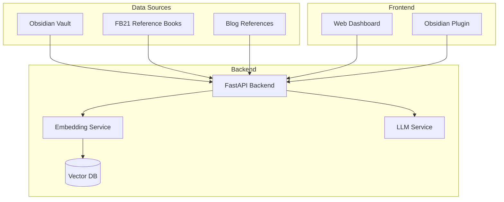

# ITPE Topic Enhancement System

정보관리기술사 시험 준비를 위한 Obsidian 기반 토픽 관리 시스템입니다. 작성한 토픽 노트의 정확성을 검증하고 기술사 시험 수준으로 내용을 보강합니다.

## Overview

이 시스템은 다음 기능을 제공합니다:

- **참조 문서 자동 연동:** FB21 수험 서적과 블로그 자동 매칭
- **지능형 검증:** 토픽 vs 참조 문서 간의 차이 자동 분석
- **우선순위 기반 제안:** 기술사 관점에서 보강 필요 항목 추천
- **직관적인 UI:** 진행 상황 시각화 및 결과 확인

## Architecture



## Quick Start

### Prerequisites

- Python 3.13+
- Node.js 22+
- Docker & Docker Compose
- Obsidian (optional)

### Installation

1. **Clone repository:**
```bash
git clone <repository-url>
cd itpe-topic-enhancement
```

2. **Start services:**
```bash
docker-compose up -d redis chromadb
```

3. **Backend setup:**
```bash
cd backend
python -m venv .venv
source .venv/bin/activate
pip install -e .
cp .env.example .env  # Edit configuration
```

4. **Frontend setup:**
```bash
cd frontend
npm install
cp .env.example .env
```

5. **Run applications:**
```bash
# Terminal 1: Backend
cd backend
uvicorn app.main:app --reload --port 8000

# Terminal 2: Frontend
cd frontend
npm run dev
```

6. **Access application:**
- Web UI: http://localhost:3000
- API Docs: http://localhost:8000/docs

## Usage

### 1. Export Topics from Obsidian

기존 Dataview JSON 내보내기 스크립트를 사용하여 토픽 추출:

```javascript
// Dataview 스크립트 실행 후
// "JSON 내보내기 (전체)" 버튼 클릭
// 클립보드에 복사된 JSON 저장
```

### 2. Upload to System

Web UI 또는 API를 통해 토픽 업로드:

```bash
curl -X POST http://localhost:8000/api/v1/topics/upload \
  -H "Content-Type: application/json" \
  -d @topics.json
```

### 3. Validate Topics

검증 요청:

```bash
curl -X POST http://localhost:8000/api/v1/validate \
  -H "Content-Type: application/json" \
  -d '{"topic_ids": ["topic-001", "topic-002"]}'
```

### 4. Review Proposals

Web UI에서 검증 결과 확인 및 제안 적용:

1. Dashboard에서 진행 상황 확인
2. Validation Results에서 상세 내용 확인
3. Proposals에서 우선순위별 제안 검토
4. Apply 버튼으로 마크다운 파일 업데이트

## Documentation

- **[System Design](DESIGN.md)**: 전체 시스템 설계
- **[Technology Stack](TECH_STACK.md)**: 기술 스택 상세
- **[Project Structure](PROJECT_STRUCTURE.md)**: 프로젝트 구조
- **[API Documentation](http://localhost:8000/docs)**: OpenAPI/Swagger (실행 중일 때)

## Configuration

### Backend (.env)

```bash
# Database
DATABASE_URL=sqlite+aiosqlite:///./data/itpe-enhancement.db

# Redis
REDIS_URL=redis://localhost:6379/0

# Vector DB
CHROMADB_PATH=./data/chromadb

# LLM (OpenAI)
OPENAI_API_KEY=sk-...
LLM_MODEL=gpt-4o
LLM_TEMPERATURE=0.3

# Embedding
EMBEDDING_MODEL=sentence-transformers/paraphrase-multilingual-MPNet-base-v2
EMBEDDING_DEVICE=cuda  # or cpu

# Obsidian
OBSIDIAN_VAULT_PATH=/path/to/obsidian/vault
```

### Frontend (.env)

```bash
VITE_API_URL=http://localhost:8000
VITE_APP_NAME=ITPE Topic Enhancement
```

## Development

### Backend Development

```bash
cd backend

# Run tests
pytest

# Run with coverage
pytest --cov=app --cov-report=html

# Format code
ruff format app/
ruff check app/

# Type check
mypy app/
```

### Frontend Development

```bash
cd frontend

# Run dev server
npm run dev

# Run tests
npm run test

# Lint
npm run lint

# Type check
npx tsc --noEmit
```

## Deployment

### Docker Deployment

```bash
# Build and start all services
docker-compose up -d

# Check logs
docker-compose logs -f backend

# Stop services
docker-compose down
```

### Production Deployment

1. **Configure systemd service:**
```bash
sudo cp scripts/itpe-enhancement.service /etc/systemd/system/
sudo systemctl enable itpe-enhancement
sudo systemctl start itpe-enhancement
```

2. **Configure nginx:**
```bash
sudo cp nginx.conf /etc/nginx/sites-available/itpe-enhancement
sudo ln -s /etc/nginx/sites-available/itpe-enhancement /etc/nginx/sites-enabled/
sudo nginx -t
sudo systemctl reload nginx
```

## Roadmap

### Phase 1: MVP (Conservative) - 2-3 weeks
- [ ] PDF/Markdown parser
- [ ] Keyword-based matching
- [ ] Basic validation rules
- [ ] Simple web UI

### Phase 2: Core (Balanced) - 4-5 weeks
- [ ] Embedding-based matching
- [ ] LLM proposal generation
- [ ] Advanced validation rules
- [ ] Full-featured UI
- [ ] Obsidian plugin

### Phase 3: Advanced (Aggressive) - 3-4 weeks
- [ ] RAG pipeline
- [ ] Local LLM support
- [ ] Feedback learning
- [ ] Performance optimization

## Contributing

1. Fork repository
2. Create feature branch (`git checkout -b feature/amazing-feature`)
3. Commit changes (`git commit -m 'feat: add amazing feature'`)
4. Push to branch (`git push origin feature/amazing-feature`)
5. Open Pull Request

## License

MIT License - see LICENSE file for details

## Support

- **Issues:** GitHub Issues
- **Discussions:** GitHub Discussions
- **Email:** support@example.com

## Acknowledgments

- FB21 수험서 저자님
- 블로그 참조 (https://blog.skby.net)
- Obsidian 커뮤니티

---

**Version:** 1.0.0
**Status:** Design Phase
**Last Updated:** 2026-02-02
