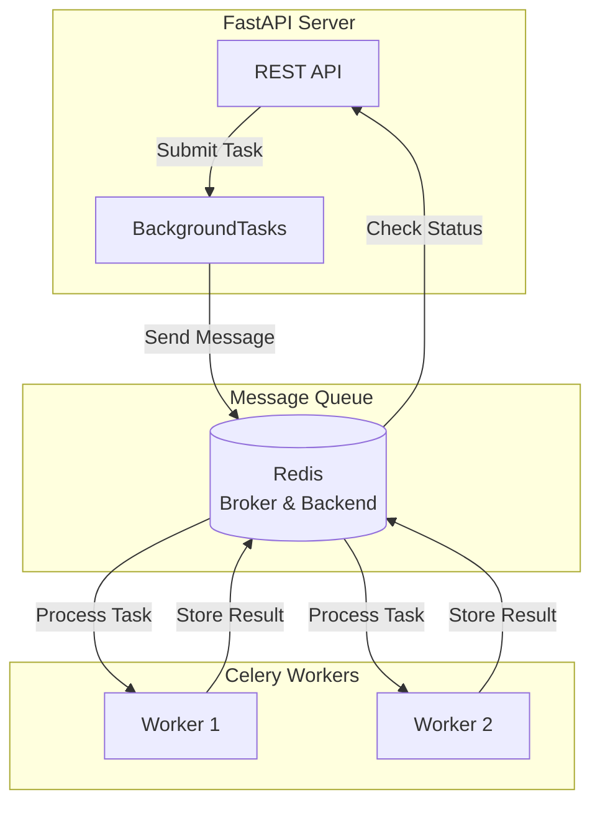

# ITPE Topic Enhancement Backend

FastAPI backend for ITPE Topic Enhancement System.

## Setup

```bash
# Create virtual environment
python -m venv .venv
source .venv/bin/activate  # On Windows: .venv\Scripts\activate

# Install dependencies
pip install -e .

# Copy environment file
cp .env.example .env

# Edit .env with your settings
nano .env
```

## Running

```bash
# Development
uvicorn app.main:app --reload --port 8000

# Production
uvicorn app.main:app --host 0.0.0.0 --port 8000
```

## API Documentation

When running in debug mode, visit:
- Swagger UI: http://localhost:8000/docs
- ReDoc: http://localhost:8000/redoc

### New Endpoints (SPEC-FIX-P0)

#### Keywords API

**GET /api/v1/keywords/suggest**

데이터 소스에서 실제 키워드를 추출하여 추천합니다.

**Parameters:**
- `domain` (optional): 필터링할 도메인 (SW, NW, DB, 정보보안, 신기술, 경영, 기타)
- `top_k` (optional): 반환할 키워드 수 (기본값: 10, 최대: 50)

**Response:**
```json
{
  "success": true,
  "data": {
    "keywords": ["REST API", "TCP/IP", "데이터베이스", ...],
    "count": 10
  }
}
```

**Examples:**
```bash
# 모든 도메인 상위 10개 키워드
curl "http://localhost:8000/api/v1/keywords/suggest"

# SW 도메인 상위 20개 키워드
curl "http://localhost:8000/api/v1/keywords/suggest?domain=SW&top_k=20"
```

**Features:**
- 복합어 보존 (TCP/IP, REST API 등 분리 방지)
- 동의어 확장
- 불용어 필터링
- 데이터 소스: 600제, 서브노트

#### Metrics API

**GET /api/v1/metrics/summary**

모든 메트릭 요약을 반환합니다.

**Response:**
```json
{
  "success": true,
  "data": {
    "keyword_relevance": {
      "precision": 0.85,
      "recall": 0.78,
      "f1_score": 0.81
    },
    "reference_discovery": {
      "discovery_rate": 0.92,
      "coverage_rate": 0.88,
      "avg_similarity": 0.75
    },
    "validation_accuracy": {
      "accuracy": 0.83,
      "total_validations": 150
    },
    "system_performance": {
      "avg_response_time_ms": 245,
      "success_rate": 0.98,
      "total_requests": 500
    }
  }
}
```

**Example:**
```bash
curl "http://localhost:8000/api/v1/metrics/summary"
```

**Metric Categories:**
- `keyword_relevance`: 키워드 관련성 메트릭
- `reference_discovery`: 참조 문서 발견 메트릭
- `validation_accuracy`: 검증 정확도 메트릭
- `system_performance`: 시스템 성능 메트릭

### LLM Configuration

**환경변수 설정 (`.env`):**

```bash
# LLM 제공자 선택
LLM_PROVIDER=openai  # openai 또는 ollama

# OpenAI 설정
OPENAI_API_KEY=sk-...
OPENAI_MODEL=gpt-4o

# Ollama 설정
OLLAMA_BASE_URL=http://localhost:11434
OLLAMA_MODEL=llama3.1:8b

# LLM 파라미터
LLM_TEMPERATURE=0.3
LLM_MAX_TOKENS=1000
```

**Features:**
- OpenAI 및 Ollama 지원
- 24시간 LLM 응답 캐싱
- LLM 호출 실패 시 fallback 메커니즘
- JSON 형식 응답 지원

## Testing

```bash
pytest
pytest --cov=app --cov-report=html
```

## Background Task Transaction Management

### Important Note for Developers

백그라운드 작업(BackgroundTasks)에서 데이터베이스 작업을 수행할 때는 **명시적 트랜잭션 커밋**이 필요합니다.

### Pattern

일반 FastAPI 엔드포인트에서는 `get_db()` dependency가 트랜잭션 커밋을 자동으로 처리합니다:

```python
@router.post("/")
async def create_endpoint(db: AsyncSession = Depends(get_db)):
    # Repository calls use flush()
    await repository.create(data)
    # get_db() handles commit automatically
    return {"status": "ok"}
```

하지만 백그라운드 작업에서는 `async_session()`을 직접 사용하므로 명시적 커밋이 필요합니다:

```python
async def _process_validation(...):
    """
    Background task to process validation.

    Transaction Management:
    - This function uses async_session() which does NOT auto-commit
    - Explicit commits are required to persist changes to database
    """
    from app.db.session import async_session

    try:
        async with async_session() as db:
            # Perform database operations
            await repository.create(data)
            await task_repo.update_status(task_id, "completed")

            # CRITICAL: Explicit commit to persist changes
            await db.commit()

    except Exception as e:
        # Error handling with new session
        async with async_session() as db:
            await task_repo.update_status(task_id, "failed", error=str(e))
            await db.commit()
```

### Key Points

1. **리포지토리 계층은 `flush()`만 수행**: 데이터베이스 세션에 변경사항을 보내지만 커밋하지 않습니다
2. **커밋은 서비스/엔드포인트 계층의 책임**: 트랜잭션의 원자성을 보장하기 위해 상위 계층에서 커밋을 관리합니다
3. **에러 처리에도 커밋 필요**: 실패 상태를 저장할 때도 명시적 커밋이 필요합니다
4. **Event Loop 관리**: 백그라운드 작업은 별도의 event loop에서 실행되므로 적절한 정리가 필요합니다

### Related Documentation

- [SPEC-FIX-001](../.moai/specs/SPEC-FIX-001/spec.md) - 트랜잭션 커밋 문제 수정 사양
- [Background Task Transaction Management](../.moai/docs/background-task-transaction-management.md) - 상세 가이드

## Celery Background Task System

이 시스템은 **Celery**를 사용하여 비동기 백그라운드 작업을 처리합니다.

### Architecture



### Running Celery Workers

**개발 환경:**
```bash
# Redis 실행
docker-compose up -d redis

# Celery worker 실행 (백엔드 디렉토리에서)
celery -A app.services.llm.worker worker --loglevel=info

# 또는 여러 worker 실행
celery -A app.services.llm.worker worker --loglevel=info --concurrency=4
```

**프로덕션 환경:**
```bash
# systemd service로 실행
sudo systemctl start celery-worker
sudo systemctl enable celery-worker
```

### Celery Configuration

`.env` 파일에서 Celery 설정:

```bash
# Celery Broker (Redis)
CELERY_BROKER_URL=redis://localhost:6379/0

# Celery Result Backend
CELERY_RESULT_BACKEND=redis://localhost:6379/0

# Celery Worker 설정
CELERY_TASK_TRACK_STARTED=true
CELERY_TASK_TIME_LIMIT=3600
```

### Sync Session Pattern for Celery Workers

Celery worker는 별도의 프로세스에서 실행되며 자체 이벤트 루프를 가집니다. 따라서 **동기 DB 세션**을 사용해야 합니다:

```python
# Celery task에서 동기 세션 사용
from app.db.session import SyncSessionLocal
from app.db.repositories.validation_sync import ValidationRepositorySync

@celery_app.task
def process_validation_task(validation_id: str):
    with SyncSessionLocal() as db:
        repo = ValidationRepositorySync(db)
        validation = repo.get(validation_id)
        # 처리 로직...
        db.commit()  # 명시적 커밋
```

### Monitoring

**Flower로 Celery 모니터링:**
```bash
# Flower 설치
pip install flower

# Flower 실행
celery -A app.services.llm.worker flower

# 접속: http://localhost:5555
```

**Redis CLI로 작업 상태 확인:**
```bash
# Redis 연결
redis-cli

# 모든 Celery 키 확인
KEYS celery-task-meta-*

# 특정 작업 결과 확인
GET celery-task-meta-<task-id>
```

### Testing

**Celery task 테스트:**
```bash
# 테스트용 worker 실행
celery -A app.services.llm.worker worker --loglevel=debug

# 통합 테스트 실행
pytest tests/integration/test_validation_celery_characterization.py -v
```

### Related Documentation

- [SPEC-CELERY-001](../.moai/specs/SPEC-CELERY-001/spec.md) - Celery 마이그레이션 사양
- [SPEC-BGFIX-002](../.moai/specs/SPEC-BGFIX-002/spec.md) - Async/Sync 호환성 사양
